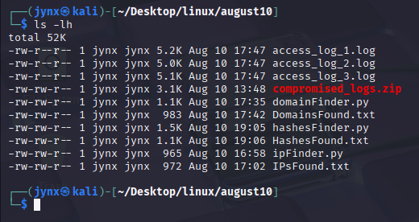

# IOC Extraction Case Report

📅**Date: `[2025-08-10]`**

## 📂 Dataset

- **Analyst:** **`Jynx`**
- **Source:** **Apache Access Logs from compromised web server simulated under controlled environments.**
- **Files:**
    
    
    
    - **`access_log_1.log`**
        
        
        
    - **`access_log_2.log`**
        
        
        
    - **`access_log_3.log`**
        
        
        

---

## 🔭Objective(s)

1. **Extract Unique IP Addresses into .txt file from the log files.**
2. **Extract Unique Domain Names into .txt file from the log files.**
3. **Extract MD5 and SHA256 hashed texts.**

---

## 🧪Detection Methodology

| IOC Type | Regex Pattern Used | Notes |
| --- | --- | --- |
| IPv4 | **`r"\b(?:\d{1,3}\.){3}\d{1,3}\b"`** | Matches all dotted IPv4 addresses |
| Domain | **`r"https?://([\w\.-]+)", re.IGNORECASE`** | Matches clean & malicious domains |
| MD5 | **`r"\b[a-fA-F0-9]{32}\b"`** | Detects MD5 hashes |
| SHA256 | **`r"\b[a-fA-F0-9]{64}\b"`** | Detects SHA256 hashes |

---

## 📠Scripts & Findings

**Language:** **`Python 3.13.3`**

### **1. IP Address Extraction**

### 💾 **Execution Script:**


**Python Script [code]** 

```python
import re
from datetime import datetime

filename = input("Enter your FILE name (.log): ")

ipPattern = re.compile(r"\b(?:\d{1,3}\.){3}\d{1,3}\b")

with open(filename, "r", errors="ignore") as f:
        text = f.read()

IPs = ipPattern.findall(text)
UniqueIPs = sorted(set(IPs))    # set data-types removes duplicates

if IPs:
        print(f"\nTotal {len(IPs)} IP addresses in {filename} found.")
        print(f"\nTotal Unique {len(IPs)} IP addresses in {filename} found:")
        for ip in UniqueIPs:
                print(" ", ip)

        with open("IPsFound.txt", "a") as out:
                out.write("\n" + "="*50 + "\n")
                out.write(f"Results from file: {filename}(Scanned: {datetime.now().strftime('%Y-%m-%d %H:%M:%S')})\n")
                out.write(f"Total {len(IPs)} IP addresses Found.\n")
                out.write(f"Total Unique IP addresses found - {len(UniqueIPs)}:\n")
                for ip in UniqueIPs:
                        out.write(ip+"\n")
                out.write("="*50 + "\n\n")
        print("\nResults saved to IPsFound.txt")
else:
        print(f"NO IP address found in {filename}.")
```

### **📑 Findings:**


**Extracted IPs:**


### **2. Domain Name Extraction**

### 💾 **Execution Script:**


**Python Script:** 

```python
import re
from datetime import datetime

filename = input("Enter your FILE name (.log): ")

domainPattern = re.compile(r"https?://([\w\.-]+)", re.IGNORECASE)

with open(filename, "r", errors="ignore") as f:
    text = f.read()

domains = domainPattern.findall(text)
unique_domains = sorted(set(domains))

if domains:
    print(f"\nTotal {len(domains)} domains in {filename} found.")
    print(f"\nTotal Unique {len(unique_domains)} domains in {filename} found:")
    for domain in unique_domains:
        print(" ", domain)
    with open("DomainsFound.txt", "a") as out:
        out.write("\n" + "="*50 + "\n")
        out.write(f"Domain Results from file: {filename}  (Scanned: {datetime.now().strftime('%Y-%m-%d %H:%M:%S')})\n")
        out.write(f"Total {len(domains)} domains found.\n")
        out.write(f"Total Unique domains found - {len(unique_domains)}:\n")
        for domain in unique_domains:
            out.write(domain + "\n")
        out.write("="*50 + "\n\n")

    print("\nDomain results appended to DomainsFound.txt")

else:
    print(f"NO domains found in {filename}.")
```

### 📑 Findings:


**Extracted Domain(s):**


### **3. MD5 and SHA256 Extraction**

### 💾 **Execution Script:**


**Python Script:** 

```python
import re
from datetime import datetime

filename = input("Enter your FILE name (.log): ")

md5Pattern = re.compile(r"\b[a-fA-F0-9]{32}\b")
sha256Pattern = re.compile(r"\b[a-fA-F0-9]{64}\b")

with open(filename, "r", errors="ignore") as f:
    text = f.read()

md5Hashes = md5Pattern.findall(text)
sha256Hashes = sha256Pattern.findall(text)

if md5Hashes or sha256Hashes:
    print(f"\nTotal MD5 hashes found: {len(md5Hashes)}")
    print(f"Total Unique MD5: {len(set(md5Hashes))}")
    for h in set(md5Hashes):
        print(" ", h)

    print(f"\nTotal SHA256 hashes found: {len(sha256Hashes)}")
    print(f"Total Unique SHA256: {len(set(sha256Hashes))}")
    for h in set(sha256Hashes):
        print(" ", h)

    with open("HashesFound.txt", "a") as out:
        out.write("\n" + "="*50 + "\n")
        out.write(f"Hash Results from file: {filename}  (Scanned: {datetime.now().strftime('%Y-%m-%d %H:%M:%S')})\n")
        out.write(f"Total MD5 hashes: {len(md5Hashes)}\n")
        out.write(f"Total Unique MD5: {len(set(md5Hashes))}\n")
        for h in sorted(set(md5Hashes)):
            out.write(h + "\n")
        out.write(f"\nTotal SHA256 hashes: {len(sha256Hashes)}\n")
        out.write(f"Total Unique SHA256: {len(set(sha256Hashes))}\n")
        for h in sorted(set(sha256Hashes)):
            out.write(h + "\n")
        out.write("="*50 + "\n")

    print("\nResults saved to HashesFound.txt")
else:
    print(f"No MD5 or SHA256 hashes found in {filename}.")
```

### 📑 Findings:


**Extracted MD5 and SHA256 Hashes:**


---
